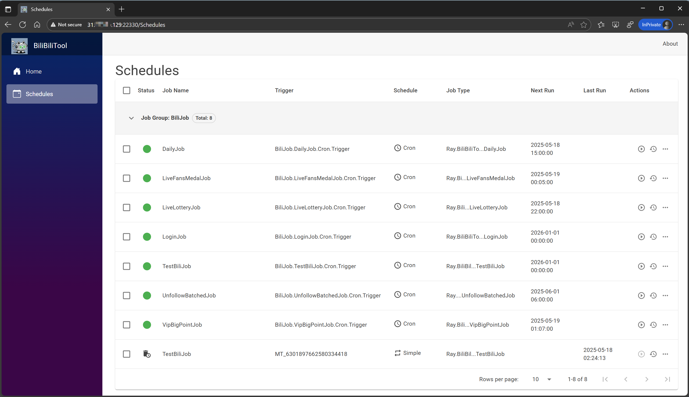
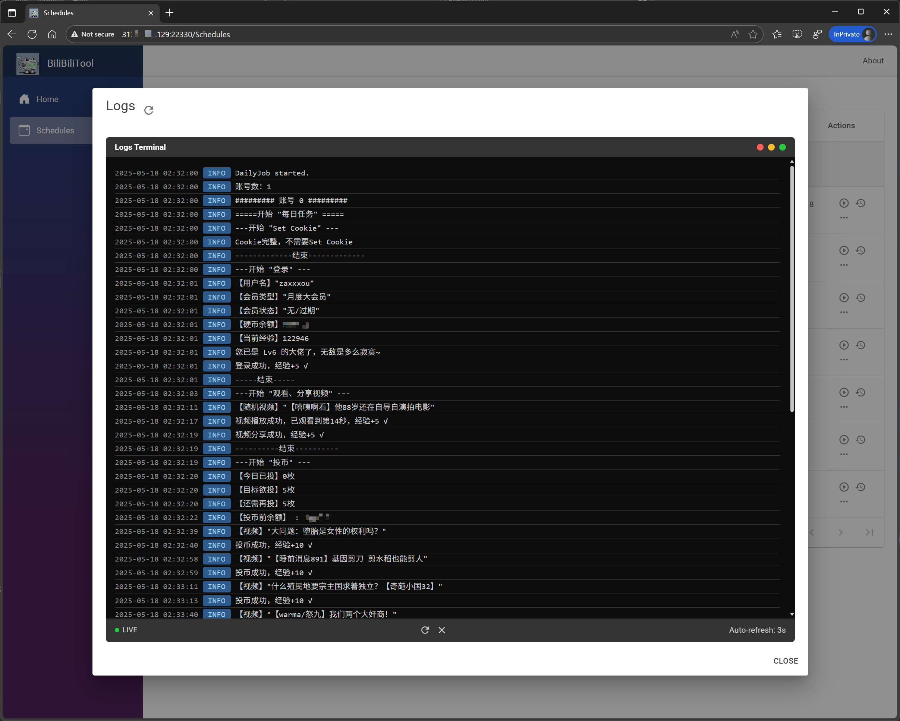

<div align="center">

<h1 align="center">

BiliTool

</h1>

[](https://github.com/trler/BiliBiliToolPro/stargazers)
[](https://github.com/trler/BiliBiliToolPro/network)
[](https://github.com/trler/BiliBiliToolPro/issues)
[](https://github.com/trler/BiliBiliToolPro/blob/main/LICENSE)

</div>

**BiliTool 是一个自动执行任务的工具，当我们忘记做某项任务时，它会像一个贴心小助手，按照我们预先吩咐它的命令，在指定频率、时间范围内帮助我们完成计划的任务。**

**本项目基于 [RayWangQvQ/BiliBiliToolPro](https://github.com/RayWangQvQ/BiliBiliToolPro) 进行了简化，专注于Docker Web应用部署，并增强了推送功能。**

主要功能如下：

- **扫码登录，自动更新cookie**
- **每日获取满额升级经验（登录、投币、点赞、分享视频）（支持指定支持up主）**
- **直播间挂机**
- **每天漫画签到**
- **每天直播签到**
- **直播中心银瓜子兑换为硬币**
- **每月领取大会员赠送的 5 张 B 币券和福利**
- **每月领取大会员漫画福利**
- **月底在 B 币券过期前进行充电（支持指定想要支持的up主）**
- **直播中心天选时刻自动参与抽奖**
- **批量取关**
- **大会员大积分任务**
- **支持多账号**
- **完整支持推送功能（Telegram、企业微信、钉钉、PushPlus、Server酱等）**

---

## 🚀 快速开始

### 一键部署（推荐）

```bash
bash <(curl -sSL https://raw.githubusercontent.com/trler/BiliBiliToolPro/main/docker/install.sh)
```

### 手动部署

```bash
# 创建目录
mkdir bili_tool_web && cd bili_tool_web

# 下载配置文件
wget https://raw.githubusercontent.com/trler/BiliBiliToolPro/main/docker/sample/docker-compose.yml
mkdir -p config

# 启动
docker compose up -d

# 查看日志
docker logs -f bili_tool_web
```

### 直接运行

```bash
docker run -d --name="bili_tool_web" \
    -p 22330:8080 \
    -e TZ=Asia/Shanghai \
    -v ./Logs:/app/Logs \
    -v ./config:/app/config \
    ghcr.io/trler/bili_tool_web:latest
```

## 📱 使用说明

1. **访问Web界面**：打开浏览器访问 `http://your_server_ip:22330`
2. **扫码登录**：首次使用需要扫码登录添加B站账号
3. **配置推送**：可选配置消息推送功能
4. **查看日志**：通过Web界面或 `docker logs -f bili_tool_web` 查看运行日志

运行界面预览：

<p align="center">
    
    
</p>

## 🔔 推送功能配置

支持多种推送方式，可在 `docker-compose.yml` 中配置：

### PushPlus推送（推荐）
```yaml
environment:
  Ray_Serilog__WriteTo__9__Args__token: "your_pushplus_token"
  Ray_Serilog__WriteTo__9__Args__restrictedToMinimumLevel: "Information"
```

### Telegram推送
```yaml
environment:
  Ray_Serilog__WriteTo__3__Args__botToken: "your_bot_token"
  Ray_Serilog__WriteTo__3__Args__chatId: "your_chat_id"
  Ray_Serilog__WriteTo__3__Args__restrictedToMinimumLevel: "Information"
```

更多推送配置请参考：[Docker部署详细说明](docker/README.md)

## ⚙️ 功能任务说明

| 任务名 | 功能 | 推荐运行频率 |
| :----: | :----: | :----: |
| 扫码登录 | 扫码登录，初始化或更新cookie | 手动 |
| 每日任务 | 完成每日任务获取满额65点经验 | 每天一次 |
| 天选时刻抽奖 | 直播中心天选时刻抽奖 | 建议每天0-4次 |
| 批量取关 | 批量取关指定分组下的关注 | 需要时手动运行 |
| 大会员大积分 | 大会员大积分任务 | 每天凌晨一点 |
| 直播间挂机 | 直播间挂机获取亲密度 | 每天一次 |

## 📖 配置说明

- **个性化配置**：[配置说明文档](docs/configuration.md)
- **常见问题**：[问题解答文档](docs/questions.md)
- **Docker部署详细说明**：[Docker部署文档](docker/README.md)

## 🔄 自动更新

本项目已配置GitHub Actions，每次代码更新时会自动构建和发布新的镜像。

使用Watchtower可以实现容器自动更新：
```bash
docker run --rm \
    -v /var/run/docker.sock:/var/run/docker.sock \
    containrrr/watchtower \
    --run-once --cleanup \
    bili_tool_web
```

## 📝 注意事项

- **本应用仅用于学习和测试，请勿滥用！**
- **所有代码都是开源且透明的，程序不会保存或滥用任何用户的个人信息**
- **云服务器请记得开放22330端口**
- **首次运行后，请执行扫码登录任务添加账号**

## 📄 许可证

本项目基于 [MIT 许可证](LICENSE) 开源。

---

**原项目地址：[RayWangQvQ/BiliBiliToolPro](https://github.com/RayWangQvQ/BiliBiliToolPro)**
