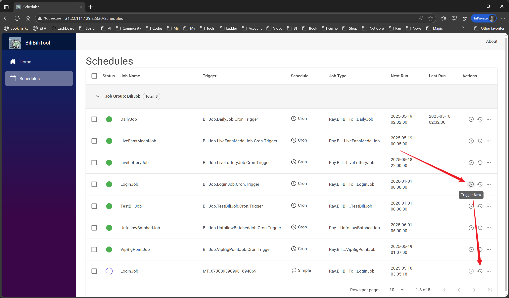

# Docker 使用说明
<!-- TOC depthFrom:2 -->

- [1. 前期工作](#1-前期工作)
- [2. 方式一：一键脚本(推荐)](#2-方式一一键脚本推荐)
- [3. 方式二：手动 Docker Compose](#3-方式二手动-docker-compose)
    - [3.1. 启动](#31-启动)
    - [3.2. 其他命令参考](#32-其他命令参考)
- [4. 方式三：手动Docker指令](#4-方式三手动docker指令)
    - [4.1. Docker启动](#41-docker启动)
    - [4.2. 其他指令参考](#42-其他指令参考)
    - [4.3. 使用Watchtower更新容器](#43-使用watchtower更新容器)
- [5. 登录 Bili](#5-登录-bili)
- [6. 推送功能配置（重要！）](#6-推送功能配置重要)
    - [6.1. 快速配置PushPlus推送](#61-快速配置pushplus推送)
    - [6.2. 其他推送平台配置](#62-其他推送平台配置)
    - [6.3. 推送功能测试](#63-推送功能测试)
- [7. 自己构建镜像（非必须）](#7-自己构建镜像非必须)
- [8. 其他](#8-其他)

<!-- /TOC -->
## 1. 前期工作

```
apt-get update
apt-get install curl
```

## 2. 方式一：一键脚本(推荐)

```
bash <(curl -sSL https://raw.githubusercontent.com/trler/BiliBiliToolPro/main/docker/install.sh)
```

## 3. 方式二：手动 Docker Compose

### 3.1. 启动

```
# 创建目录
mkdir bili_tool_web && cd bili_tool_web

# 下载
wget https://raw.githubusercontent.com/trler/BiliBiliToolPro/main/docker/sample/docker-compose.yml
mkdir -p config
cd ./config
wget https://raw.githubusercontent.com/trler/BiliBiliToolPro/main/docker/sample/config/cookies.json
cd ..

# 启动
docker compose up -d

# 查看启动日志
docker logs -f bili_tool_web
```

最终文件结构如下：

```
bili_tool_web
├── Logs
├── config
├──── cookies.json
└── docker-compose.yml
```

### 3.2. 其他命令参考

```
# 启动 docker-compose
docker compose up -d

# 停止 docker-compose
docker compose stop

# 查看实时日志
docker logs -f bili_tool_web

# 进入容器
docker exec -it bili_tool_web /bin/bash

# 手动更新容器
docker compose pull && docker compose up -d
```

## 4. 方式三：手动Docker指令

### 4.1. Docker启动

```
# 创建目录
mkdir bili_tool_web && cd bili_tool_web

# 生成并运行容器
docker pull ghcr.io/trler/bili_tool_web
docker run -d --name="bili_tool_web" \
    -p 22330:8080 \
    -e TZ=Asia/Shanghai \
    -v ./Logs:/app/Logs \
    -v ./config:/app/config \
    ghcr.io/trler/bili_tool_web

# 查看实时日志
docker logs -f bili_tool_web
```

其中，`cookie`需要替换为自己真实的cookie字符串

### 4.2. 其他指令参考

```
# 启动容器
docker start bili_tool_web

# 停止容器
docker stop bili_tool_web

# 重启容器
docker restart bili_tool_web

# 删除容器
docker rm bili_tool_web

# 进入容器
docker exec -it bili_tool_web /bin/bash
```

### 4.3. 使用Watchtower更新容器
```
docker run --rm \
    -v /var/run/docker.sock:/var/run/docker.sock \
    containrrr/watchtower \
    --run-once --cleanup \
    bili_tool_web
```

## 5. 登录 Bili

扫码进行登录。




## 6. 推送功能配置（重要！）

🎉 **BiliTool Web版现已完整支持推送功能！** 当任务执行完成后，会自动将结果推送到您配置的平台。

### 6.1. 快速配置PushPlus推送

**PushPlus是最简单易用的推送方式，强烈推荐！**

1. **获取Token**：
   - 访问 [PushPlus官网](http://www.pushplus.plus/)
   - 使用微信扫码登录
   - 复制您的Token

2. **修改docker-compose.yml**：
   ```yaml
   services:
     bili_tool_web:
       image: ghcr.io/raywangqvq/bili_tool_web
       container_name: bili_tool_web
       restart: unless-stopped
       tty: true
       volumes:
         - ./Logs:/app/Logs
         - ./config:/app/config
       ports:
         - "22330:8080"
       environment:
         TZ: "Asia/Shanghai"
         DailyTaskConfig__Cron: "0 0 15 * * ?"
         # 推送配置 - PushPlus
         Ray_Serilog__WriteTo__9__Args__token: "your_pushplus_token"
         Ray_Serilog__WriteTo__9__Args__restrictedToMinimumLevel: "Information"
         # 可选配置
         Ray_Serilog__WriteTo__9__Args__channel: "wechat"
   ```

3. **重启容器**：
   ```bash
   docker compose down
   docker compose up -d
   ```

### 6.2. 其他推送平台配置

#### Telegram推送
```yaml
environment:
  # Telegram推送
  Ray_Serilog__WriteTo__3__Args__botToken: "your_bot_token"
  Ray_Serilog__WriteTo__3__Args__chatId: "your_chat_id"
  Ray_Serilog__WriteTo__3__Args__restrictedToMinimumLevel: "Information"
```

#### 企业微信机器人推送
```yaml
environment:
  # 企业微信机器人
  Ray_Serilog__WriteTo__4__Args__webHookUrl: "your_webhook_url"
  Ray_Serilog__WriteTo__4__Args__restrictedToMinimumLevel: "Information"
```

#### 钉钉机器人推送
```yaml
environment:
  # 钉钉机器人
  Ray_Serilog__WriteTo__5__Args__webHookUrl: "your_webhook_url"
  Ray_Serilog__WriteTo__5__Args__restrictedToMinimumLevel: "Information"
```

#### Server酱推送
```yaml
environment:
  # Server酱
  Ray_Serilog__WriteTo__6__Args__turboScKey: "your_sckey"
  Ray_Serilog__WriteTo__6__Args__restrictedToMinimumLevel: "Information"
```

### 6.3. 推送功能测试

1. **手动触发测试**：
   - 访问Web界面：`http://your_server_ip:22330`
   - 手动触发一个任务
   - 检查是否收到推送消息

2. **查看日志确认**：
   ```bash
   docker logs -f bili_tool_web
   # 查看是否有推送相关日志
   ```

3. **推送效果示例**：
   ```
   [15:00:01 INF] -----开始每日任务-----
   [15:00:02 INF] 登录成功，用户名: "您的用户名"
   [15:00:03 INF] 硬币余额: 1234
   [15:00:04 INF] 今日投币完成 (5/5)
   [15:00:05 INF] -----每日任务执行完成-----
   ```

**📋 支持的推送平台一览表**：

| 推送平台 | 配置难度 | 推荐度 | 配置索引 |
|----------|----------|--------|----------|
| PushPlus | ⭐ | ⭐⭐⭐⭐⭐ | WriteTo__9 |
| Telegram | ⭐⭐ | ⭐⭐⭐⭐⭐ | WriteTo__3 |
| 企业微信机器人 | ⭐⭐ | ⭐⭐⭐⭐ | WriteTo__4 |
| 钉钉机器人 | ⭐⭐ | ⭐⭐⭐⭐ | WriteTo__5 |
| Server酱 | ⭐ | ⭐⭐⭐ | WriteTo__6 |

详细配置教程请参考：[推送功能详细配置文档](PUSH_CONFIG.md)

## 7. 自己构建镜像（非必须）

目前提供和维护的镜像：

- GitHub Container Registry: `ghcr.io/trler/bili_tool_web`
- DockerHub: `trler/bili_tool_web`

如果有需要（大部分都不需要），可以使用源码自己构建镜像，如下：

在有项目的Dockerfile的目录运行

`docker build -t TARGET_NAME .`

`TARGET_NAME`为镜像名称和版本，可以自己起个名字

**自动构建：** 本项目已配置GitHub Actions，每次推送代码到main分支时会自动构建并发布新的镜像。

## 8. 其他

代码编译和发布环境: mcr.microsoft.com/dotnet/sdk:8.0

代码运行环境: mcr.microsoft.com/dotnet/aspnet:8.0

如果下载`github`资源有问题，可以尝试添加加速器。
